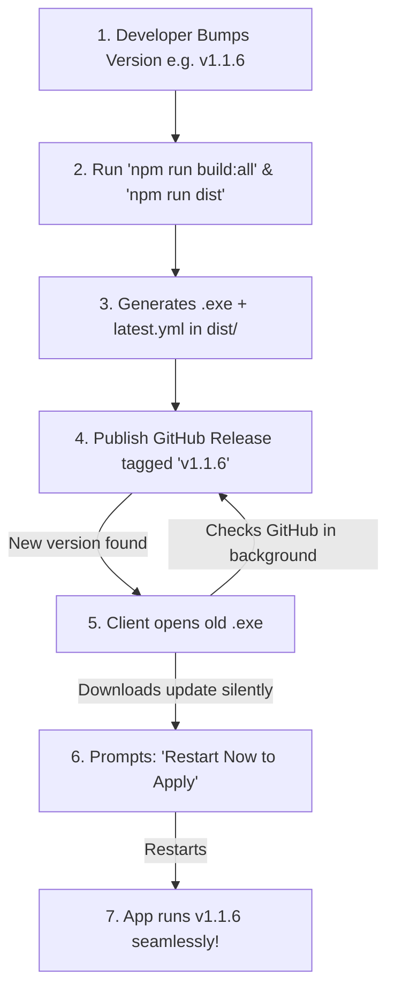

# 🔄 Virtual Tour Engine — Desktop Auto-Updater Guide

This guide explains how the **automatic update system** works for the desktop application (`.exe`) and provides a step-by-step workflow for releasing updates to your clients without requiring them to manually reinstall the application.

---

## 🏗️ 1. How the Auto-Updater Works



1. **Integrated Module:** The desktop app uses `electron-updater` configured inside `main.js`.
2. **Startup & Hourly Checks:** Every time the app is launched (and every 60 minutes while open), it queries GitHub Releases for the configured repository (`Vetriselvan11/virtual-tour-desktop`).
3. **Delta Downloads:** It compares `latest.yml` against the client's current version. If a newer version exists, it silently downloads the update.
4. **Seamless Restart:** When the download completes, a prompt appears allowing the user to **"Restart Now"** or let it apply automatically on the next launch.

---

## 🚀 2. Step-by-Step Release Workflow

Follow these 4 simple steps whenever you make changes to your codebase and want all client `.exe` apps to receive the update:

### Step 1: Bump the Version Number
Update the `"version"` field in all 3 configuration files to your new version (e.g. `1.1.6`):
- `d:\360TOOL\package.json`
- `d:\360TOOL\backend\package.json`
- `d:\360TOOL\frontend\package.json`

### Step 2: Build Frontend & Package the Executable
Open your terminal in `d:\360TOOL` and run:

```powershell
# 1. Compile the React UI production bundle
cd d:\360TOOL\frontend
npm.cmd run build

# 2. Package the new .exe and updater metadata
cd d:\360TOOL
npm.cmd run dist
```

### Step 3: Publish the Release on GitHub
1. Navigate to your GitHub Repository:
   👉 **`https://github.com/Vetriselvan11/virtual-tour-desktop/releases`**
2. Click **"Draft a new release"** (or **"Create a new release"**).
3. In **Tag version**, enter: `v1.1.6` *(matching your package.json version)*.
4. In **Release title**, enter: `Release v1.1.6`.
5. Attach the **3 generated files** located in `d:\360TOOL\dist\`:
   * 📦 `Virtual Tour Engine Setup 1.1.6.exe`
   * 📄 `latest.yml`
   * 📄 `Virtual Tour Engine Setup 1.1.6.exe.blockmap`
6. Click **"Publish release"**.

### Step 4: Client Automatically Receives the Update
* Existing clients running the old application will automatically detect the new release.
* A notification dialog will appear:
  > **Update Ready**  
  > *Version 1.1.6 has been downloaded. Restart the application to apply the update immediately.*
* Clicking **Restart Now** instantly updates their installation to `1.1.6` with all saved tours and settings preserved!

---

## 📂 3. Files in `dist/` Explained

| File | Purpose |
| :--- | :--- |
| `Virtual Tour Engine Setup X.X.X.exe` | The full Windows NSIS installer for initial distribution or manual install. |
| `latest.yml` | **Crucial for Auto-Updater.** Contains version number, file size, and SHA-512 cryptographic verification hashes. |
| `Virtual Tour Engine Setup X.X.X.exe.blockmap` | Used by `electron-updater` for fast differential (delta) downloads. |
| `win-unpacked/` | Standalone unpacked folder containing `Virtual Tour Engine.exe` for instant local testing without installing. |

---

## 🔧 4. Useful Terminal Commands

```powershell
# Run the Desktop App in Development Mode (Live Window)
npm.cmd start

# Run the Backend Server only
cd backend
npm.cmd start

# Run the Frontend Web Dev Server only
cd frontend
npm.cmd start

# Build new EXE Installer + latest.yml
cd d:\360TOOL
npm.cmd run dist
```

---

## 🛠️ 5. Troubleshooting & Verification

- **Version not changing on screen?**
  Always ensure `npm.cmd run build` is run inside `frontend/` before `npm.cmd run dist` so the new React code is compiled into `frontend/build/`.
- **Client not seeing update?**
  Ensure that `latest.yml` was uploaded alongside the `.exe` in the GitHub release assets.
- **Private Repository?**
  If your release repository is private, ensure your `publish` config in `package.json` includes a `GH_TOKEN` or host your releases on a public repository.
