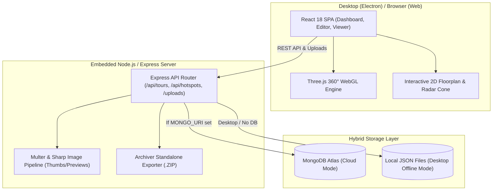

# Virtual Tour Engine — Complete Project Documentation & Technical Specification

> **Application Name**: Virtual Tour Engine (Desktop & Web)  
> **Version**: 1.1.5  
> **Author**: Vetriselvan  
> **Repository**: [github.com/Vetriselvan11/virtual-tour-desktop](https://github.com/Vetriselvan11/virtual-tour-desktop)  
> **Last Updated**: 2026-09-16  

---

## 1. Executive Summary & Overview

**Virtual Tour Engine** is a professional, high-performance 360° interactive virtual tour creation and presentation platform. It delivers an end-to-end workflow:
1. **Creation & Studio**: Users upload 360° equirectangular panoramas, configure scene transitions, place interactive navigation/media hotspots, upload multi-floor floorplans with live radar cones, and set ambient audio.
2. **WebGL Rendering Engine**: High-fidelity Three.js/OGL sphere projection with smooth inertial drag, touch gestures, gyroscope orientation, Tiny Planet intro animations, and cinematic guided walkthroughs.
3. **Distribution & Packaging**: Available both as an Electron-powered Windows Desktop Application (with auto-updating and zero-dependency local JSON database fallback) and an Offline Standalone ZIP Exporter (runs directly in standard web browsers with no backend needed).

---

## 2. Complete Technology Stack

### 🖥️ Desktop Shell
| Technology | Version | Purpose |
|---|---|---|
| **Electron** | `^28.2.0` | Cross-platform desktop runtime for Windows/macOS |
| **electron-builder** | `^24.13.3` | Packaging, code signing, and NSIS installer generation |
| **electron-updater** | `^6.8.9` | Seamless background OTA updates via GitHub Releases |
| **electron-log** | `^5.4.4` | Unified file & console logging across main and renderer processes |

### 🎨 Frontend
| Technology | Version | Purpose |
|---|---|---|
| **React** | `^18.2.0` | UI framework with React 18 concurrent rendering features |
| **React Router DOM** | `^6.22.0` | Client-side routing with v7 future flags enabled |
| **Three.js** | `^0.162.0` | 3D WebGL equirectangular sphere rendering, Raycasting & hotspot sprites |
| **OGL** | `^1.0.11` | Lightweight WebGL library for secondary low-overhead visual effects |
| **Ant Design (AntD)**| `^5.15.0` | UI Component library (modals, sliders, color pickers, forms, tables) |
| **Framer Motion** | `^12.42.2`| Micro-interactions, animated docks, modal transitions |
| **GSAP** | `^3.15.0` | Complex camera animations, FOV zooms, and Tiny Planet intro tweens |
| **Lucide React & React Icons** | `^1.23.0` / `^5.7.0` | Modern SVG iconography |
| **Axios** | `^1.6.7` | HTTP REST client with multipart upload & progress tracking |
| **UUID** | `^9.0.0` | Unique identifier generation for scenes, hotspots, and pins |

### ⚙️ Backend & Storage
| Technology | Version | Purpose |
|---|---|---|
| **Node.js / Express** | `^4.18.2` | REST API server for tour CRUD, media uploads, and exports |
| **Sharp** | `^0.35.4` | High-speed image processing: thumbnail & preview generation, equirectangular validation |
| **Multer** | `^1.4.5-lts.1` | Multipart file upload handling with disk storage and mime filtering |
| **Archiver** | `^8.0.0` | In-memory and streaming ZIP archive generation for tour standalone export |
| **Mongoose** | `^9.7.3` | MongoDB ODM for cloud storage mode |
| **Local JSON Engine** | Custom | Zero-dependency file repository fallback for standalone desktop execution |
| **express-rate-limit**| `^8.6.1` | API protection against DOS and excessive brute requests |
| **Cors & Dotenv** | `^2.8.5` / `^17.4.2`| Cross-Origin Resource Sharing & environment management |

---

## 3. High-Level Architecture



---

## 4. Completed Features & Capabilities Breakdown

### 1. 360° WebGL Panorama Viewer Core (`core/viewer`)
- **Equirectangular Sphere Mapping**: Inverts a high-resolution sphere geometry in Three.js and paints equirectangular 360° panoramas smoothly.
- **Tiny Planet Cinematic Intro**: Smoothly animates from a bird's-eye "Little Planet" stereographic projection (`FOV ~140°`, `pitch -90°`) into standard first-person perspective on tour launch.
- **Inertial Orbit & Damping**: Friction-based camera panning with configurable speed, sensitivity, and mouse/touch drag smoothness.
- **FOV Zooming & Clamping**: Mouse-wheel and pinch-to-zoom with strict boundary clamping (min FOV `30°`, max FOV `100°`).
- **Device Orientation (Gyroscope)**: One-click mobile/tablet gyro controls for physical head-tracking view.
- **Auto-Rotation Engine**: Intelligent idle-detection that starts smooth horizontal 360° rotation when user interaction pauses.
- **Fade & Zoom Scene Transitions**: Cross-fading scene transitions with directional camera easing towards clicked hotspots.

### 2. Interactive Tour Studio & Editor (`features/editor`)
- **Visual Hotspot Placer**: Click anywhere on the 360° panorama to project raycast coordinates and place interactive pins.
- **Hotspot Types Supported**:
  - 🔄 **Scene Link**: Jump directly to target 360° panorama.
  - ℹ️ **Info & Text Modal**: Rich title, body copy, and markdown explanations.
  - 🖼️ **Media & Gallery**: Image, audio, or video popups inside the viewer.
  - 🔗 **External URL**: Web links that open in browser tabs or modals.
- **Custom Hotspot Styling**: Icon selection, color palettes, scale, opacity, pulse animations, and tooltip text.
- **Default Viewport / Start Angle Setter**: Set the exact initial heading (`yaw`, `pitch`, `fov`) for each scene.
- **Scene Reordering & Folder Management**: Group scenes into folders (e.g., "Ground Floor", "Master Bedroom", "Exterior") with drag-and-drop hierarchy.

### 3. Multi-Floor Minimap & Radar Cone (`components/minimap`)
- **Multi-Level Floorplans**: Support for Floor 1 and Floor 2 floorplan layouts.
- **Interactive Pin Dropping**: Drop scene markers on top of the 2D architectural layout.
- **Real-Time Dynamic Radar Cone**: Displays a live FOV vision cone on the active pin that rotates in sync with the user's Three.js camera yaw.
- **Instant Scene Jump**: Clicking any pin on the 2D floorplan smoothly loads the corresponding 360° panorama.

### 4. Media & Asset Pipeline (`modules/asset` & `modules/upload`)
- **Automated Derivative Generation**: Background generation of `.thumb.jpg` (200px) and `.preview.jpg` (1024px) using **Sharp**.
- **On-Demand Fallback Middleware**: If a legacy or missing thumbnail is requested, Express generates it dynamically on-the-fly and caches it.
- **Equirectangular Aspect Ratio Validation**: Automatic detection and validation of 2:1 panorama dimensions.
- **Orphan Asset Cleanup**: Scans tour files and removes unreferenced media to preserve disk space.

### 5. Ambient Soundscape & Audio System
- **Global Ambient Music**: Attach background audio (.mp3, .wav) to the tour with volume controls and autoplay toggles.
- **Scene-Specific Sound**: Individual sound triggers per scene or hotspot.

### 6. Standalone Desktop & Auto-Updater (`main.js`)
- **Zero-Config Electron Desktop App**: Runs on Windows with integrated backend server.
- **Dynamic Port Selection**: If default port `5000` is busy, Express automatically increments (`5001`, `5002`...) without crashing.
- **Electron-Updater & GitHub Releases**: Automatic background checking, downloading, and prompting for updates upon launch or hourly.
- **NSIS Custom Installer**: Desktop shortcuts, start menu entry, custom install path selection.

### 7. Standalone Offline ZIP Exporter
- **Zero-Server Portable Package**: Compiles entire tour, images, floorplans, and a single-file HTML/JS viewer into a `.zip` file.
- **Self-Contained Execution**: Clients can double-click `index.html` on any USB drive or computer without installing Node, Electron, or MongoDB.

### 8. Multi-Resolution Tiled 360° Panorama Streaming Engine (`core/viewer/TileManager.js` & `backend/src/modules/asset/tileGenerator.service.js`)
- **Ultra-High-Resolution Support**: Displays 4K, 8K, 12K, and 16K+ panoramas seamlessly on standard GPUs.
- **Sharp Multi-Resolution Pyramid**: Automatically slices 4K+ equirectangular images into 512×512 WebP tile pyramids (`level_0` to `level_N`) with `metadata.json`.
- **Frustum Culling & Dynamic LOD**: Streams only spherical tile patches visible inside the active camera view, picking higher resolution LOD levels during FOV zooms.
- **Zero Black Frames Base Sphere**: Retains Level 0 base preview during scene transitions, progressively overlaying high-resolution tiles.
- **Bounded LRU Cache & VRAM Disposal**: Enforces strict GPU memory limits (32–64 tiles max) with automatic `texture.dispose()` on off-screen tiles.
- **On-Demand Slicing Middleware**: Dynamically generates missing tiles on-the-fly and serves them with immutable caching headers.

---

## 5. Directory & File Structure

```
d:/360TOOL/
├── main.js                     # Electron main process (lifecycle, window, auto-updater)
├── package.json                # Desktop app configuration & build scripts
├── AUTO_UPDATER_README.md      # Auto-update setup and release workflow guide
│
├── backend/                    # Node.js Express REST API
│   ├── package.json
│   └── src/
│       ├── app/                # Express application configuration & port failover server
│       │   ├── app.js
│       │   ├── routes.js
│       │   └── server.js
│       ├── config/             # Environment, paths, and directory configs
│       │   ├── directories.config.js
│       │   └── env.config.js
│       ├── database/           # Hybrid Database Layer
│       │   ├── connection.js   # MongoDB connection + fallback switcher
│       │   ├── models/         # Mongoose Tour model schema
│       │   └── repositories/   # Local JSON file repository for offline desktop
│       ├── middleware/         # Error handling, 404, rate limiting
│       └── modules/            # Domain modules
│           ├── asset/          # Thumbnails, previews, image references
│           ├── hotspot/        # Hotspot logic and controllers
│           ├── tour/           # Tour CRUD, export, duplication, guided tour
│           └── upload/         # Multer configuration & Sharp image processor
│
└── frontend/                   # React 18 SPA Frontend
    ├── package.json
    ├── public/
    └── src/
        ├── App.js              # Main route definitions & theme wrapper
        ├── index.js
        ├── components/         # Shared components
        │   ├── common/         # Modals, buttons, splash loaders
        │   ├── editor/         # Hotspot property inspectors & toolbars
        │   ├── minimap/        # 2D Floorplan & interactive radar cone
        │   └── viewer/         # PanoramaViewer component wrapper
        ├── context/            # Global state (Auth, Responsive, Tour Context)
        ├── core/               # Low-level 3D WebGL Engine
        │   ├── hotspots/       # Hotspot rendering, SVG sprites, pulse animations
        │   └── viewer/         # Three.js SceneManager, Camera, TinyPlanet, RenderLoop
        ├── features/           # Feature pages & state
        │   ├── dashboard/      # Tour list, creation wizard, metrics
        │   ├── editor/         # Full 360° Virtual Tour Studio
        │   ├── landing/        # Public hero landing & product introduction
        │   └── viewer/         # Fullscreen responsive tour viewer
        └── services/           # Axios API services (tourApi, uploadApi, etc.)
```

---

## 6. REST API Endpoints Reference

### 🌐 System & Version
- `GET /api/version` — Returns current running version from `package.json` (e.g. `v1.1.5`).

### 🗺️ Tours (`/api/tours`)
- `GET /api/tours` — Retrieve list of all tours.
- `GET /api/tours/:id` — Retrieve full JSON specification for a single tour.
- `POST /api/tours` — Create a new empty tour.
- `PUT /api/tours/:id` — Update tour details, scenes, hotspots, floorplans, audio.
- `DELETE /api/tours/:id` — Delete tour and purge associated media assets.
- `POST /api/tours/:id/duplicate` — Clone an existing tour with all assets.
- `GET /api/tours/:id/export` — Stream a standalone offline `.zip` bundle.

### 🖼️ Uploads & Assets (`/api/upload` & `/api/assets`)
- `POST /api/upload/single` — Upload single panorama image with automatic thumbnailing.
- `POST /api/upload/floorplan` — Upload 2D floorplan image (Floor 1 / Floor 2).
- `POST /api/upload/audio` — Upload ambient background sound file.
- `GET /uploads/:tourId/:filename` — Static file delivery of raw panorama.
- `GET /uploads/:tourId/thumbnails/:filename` — Delivery of optimized 200px thumbnail.
- `GET /uploads/:tourId/previews/:filename` — Delivery of optimized 1024px preview image.

---

## 7. Data Models & JSON Specification

```typescript
interface Tour {
  id: string;                      // Unique UUID
  title: string;                   // Tour title
  description?: string;            // Tour description
  clientLogo?: string;             // Custom branding logo URL
  clientUrl?: string;              // Client external link
  startScene: string;              // Initial scene ID on tour load
  published: boolean;              // Visibility status
  createdAt: string;
  updatedAt: string;
  
  // Floorplan & Minimap
  floorplan?: string;              // Level 1 Floorplan Image URL
  floorplanPins?: { [sceneId: string]: { x: number; y: number } };
  floor2Plan?: string;             // Level 2 Floorplan Image URL
  floor2Pins?: { [sceneId: string]: { x: number; y: number } };
  
  // Audio & Animation
  ambientAudio?: string;           // Ambient audio URL
  ambientVolume?: number;          // 0.0 to 1.0
  guidedTour?: {
    enabled: boolean;
    duration: number;
    keyframes: Array<{ sceneId: string; yaw: number; pitch: number; fov: number; duration: number }>;
  };

  // Grouping & Scenes
  folders?: { [folderId: string]: { name: string; sceneIds: string[] } };
  scenes: Array<{
    id: string;
    name: string;
    image: string;                 // Master equirectangular image URL
    thumbnail?: string;            // Optimized thumbnail URL
    defaultHeading?: { yaw: number; pitch: number; fov: number };
    hotspots: Array<{
      id: string;
      type: 'scene' | 'info' | 'media' | 'link';
      position: { x: number; y: number; z: number };
      targetScene?: string;
      title?: string;
      description?: string;
      mediaUrl?: string;
      linkUrl?: string;
      customIcon?: string;
      color?: string;
    }>;
  }>;
}
```

---

## 8. Error Handling, Edge Cases & Resilience

| Potential Issue / Error | Architectural Solution Implemented |
|---|---|
| **Port 5000 Already in Use (`EADDRINUSE`)** | `listenOnPort` automatically catches `EADDRINUSE`, tries port `5001`, `5002`... smoothly and passes active port to Electron. |
| **No MongoDB Server Available** | Connection manager detects lack of Mongo / Desktop environment and automatically switches to the `LocalJSON` file repository. |
| **Missing Thumbnails for Legacy Tours** | Dynamic Express middleware on `/uploads/:tourId/thumbnails/:file` auto-generates thumbnails from master images on the fly. |
| **Large 360° Image Crash on Low-End GPUs** | `DeviceProfile.js` detects WebGL max texture limits (`MAX_TEXTURE_SIZE`) and loads downscaled preview images on constrained devices. |
| **Pinch-Zoom / Touch Overflows** | Custom gesture clamps in `ViewerCore.js` prevent camera inversion and infinite FOV zoom glitches. |
| **Electron Auto-Update Certificate / Network Failures** | Wrapped in try/catch with `electron-log` logging; never blocks app execution if offline or GitHub API is throttled. |

---

## 9. Development & Build Commands

### Run in Local Split Development (React + Node.js)
```bash
# Terminal 1 — Backend
cd backend
npm run dev

# Terminal 2 — Frontend
cd frontend
npm start
```

### Run in Electron Desktop Mode
```bash
# Build React frontend first
npm run build:frontend

# Start Electron shell with embedded backend
npm start
```

### Build Windows Installer (.exe)
```bash
# Produces NSIS executable inside /dist
npm run dist
```

---

## 10. Summary Checklist of Features

- [x] Full Three.js 360° Equirectangular Sphere Viewer
- [x] Tiny Planet Intro Animation (GSAP Easing)
- [x] Gyroscope / Mobile Device Orientation Controls
- [x] Interactive Hotspot Editor (Scene link, Info, Media, External link)
- [x] Multi-Level 2D Floorplan / Minimap with Dynamic Radar Cone
- [x] Folders & Scene Categorization
- [x] Ambient Audio & Soundscape Engine
- [x] Offline Standalone ZIP Exporting (Zero-server runtime)
- [x] Hybrid Database (MongoDB Atlas + Local JSON File fallback)
- [x] Electron Desktop Packaging with NSIS Installer
- [x] GitHub Releases Auto-Updater Integration
- [x] Dynamic Port Failover Engine
- [x] High-performance Image Derivative Pipeline (Sharp)
- [x] Multi-Resolution Tiled 360° Panorama Streaming Engine (4K/8K/12K/16K+)

---
*End of Documentation — Virtual Tour Engine v1.1.5*
